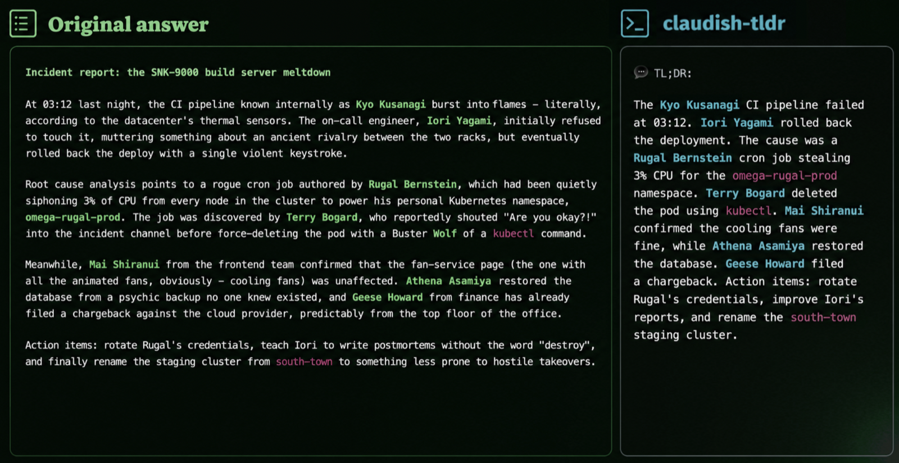

# claudish-tldr

> **TL;DR** — Claude Code writes walls of text; this adds a two-line summary under each reply (or replaces it entirely), written by a local ollama model in plain words, in any language you pick. Skim the summary, read the original only when it matters. Free, offline, and harmless: the real text is always kept, and the summary never enters Claude's context — zero extra tokens, zero context rot.



Shows a **short, simple-language summary** under each Claude Code assistant message, produced by a local LLM via [ollama](https://ollama.com) — a TL;DR of Claude's wall of text, in the language you pick. Default is English; the `/claudish` command switches language and display mode on the fly, mid-session.

Display-only: Claude's reasoning and the transcript keep the original text, and the summary is never fed back into the model's context — it costs no tokens and can't pollute or degrade the conversation (no context rot). On any failure (ollama down, timeout, missing model) it fails open and shows the original message unchanged.

Fork of [gvzdv/claudish-to-english](https://github.com/gvzdv/claudish-to-english) (v0.1.1, MIT).

## What's different from claudish-to-english?

The original rewrites every message into plain English, configured once via env vars at launch. This fork turns it into a runtime-controllable summariser:

- **`/claudish` slash command** — everything switches mid-session, no restart: pause/resume, `append`/`replace` display mode, target language, ollama model. The hooks re-read small flag files in `~/.claude` on every message, which is how the frozen-env limitation is bypassed.
- **Any target language** — the system prompt is parametric (`/claudish language german`, default English) instead of hardcoding English.
- **Summary, not just simplification** — the prompt asks for a clearly shorter TL;DR (about half the original or less), keeping facts, numbers, and file paths.
- **`/claudish last`** — reprints the untouched original of the last message from the transcript, the escape hatch for `replace` mode. Such replies carry a `<!-- claudish:original -->` marker the hook strips and never summarises.

## Requirements

- [ollama](https://ollama.com) running locally (`ollama serve`) with the default model pulled: `ollama pull gemma4:26b-mlx` (MLX build, meant for Apple Silicon)
- `jq` and `curl` on `PATH`

## Install

```sh
claude plugin marketplace add MakhBeth/claudish-tldr
claude plugin install claudish-tldr@makhbeth-plugins
```

To use a different/smaller model:

```sh
export CLAUDISH_MODEL=gemma4:12b   # or any ollama model you pulled
```

If you also use the original claudish-to-english plugin, disable it to avoid a double rewrite:

```sh
claude plugin disable claudish-to-english@gvzdv-plugins
```

### Install from a local clone (development)

```sh
git clone https://github.com/MakhBeth/claudish-tldr
claude plugin marketplace add ./claudish-tldr
claude plugin install claudish-tldr@makhbeth-plugins
```

## Config

Same env vars as the original (`CLAUDISH_MODEL`, `CLAUDISH_MODE`, `CLAUDISH_LANG`, `CLAUDISH_MIN_CHARS`, `CLAUDISH_OFF_FILE`, `CLAUDISH_MD_DIR`, ...) — see the headers of `rewrite.sh` and `rewrite-md.sh`. Default model: `gemma4:26b-mlx`. Default language: English.

## Switching on the fly

The `/claudish` slash command switches state mid-session (the hooks re-read the flag files on every message, so no restart is needed):

```
/claudish            # cycle: off -> append -> replace -> off
/claudish off        # pause, show originals only
/claudish on         # resume with the last mode
/claudish append     # original + summary appended (default)
/claudish replace    # summary only
/claudish status     # show the current state
/claudish language italian   # summarise into another language
/claudish language default   # back to English
/claudish model gemma4:12b   # switch ollama model (model default resets)
/claudish last       # reprint the ORIGINAL text of the last assistant message
```

The rewrite is display-only, so the original is never lost: press `ctrl+o` in Claude Code to view the whole original chat (the transcript keeps Claude's untouched text), or use `/claudish last` to reprint just the last message — handy in `replace` mode.

Under the hood it writes `~/.claude/claudish-mode` (`append`/`replace`, overrides `CLAUDISH_MODE`), `~/.claude/claudish-lang` (a language name, overrides `CLAUDISH_LANG`, default English), `~/.claude/claudish-model` (an ollama model name, overrides `CLAUDISH_MODEL`) and creates/removes `~/.claude/claudish-off`. You can drive the same files from a script or hotkey: `touch ~/.claude/claudish-off` to pause, remove it to resume, `echo replace > ~/.claude/claudish-mode` to switch mode.

## History

This plugin started as `claudish-to-italian`, a fork that rewrote messages into simple Italian with a hardcoded language. In 0.3.0 the target language became runtime-configurable, the default switched to English, and the plugin was renamed to `claudish-tldr`. If you installed the old name, reinstall:

```sh
claude plugin uninstall claudish-to-italian@makhbeth-plugins
claude plugin marketplace update makhbeth-plugins
claude plugin install claudish-tldr@makhbeth-plugins
```
